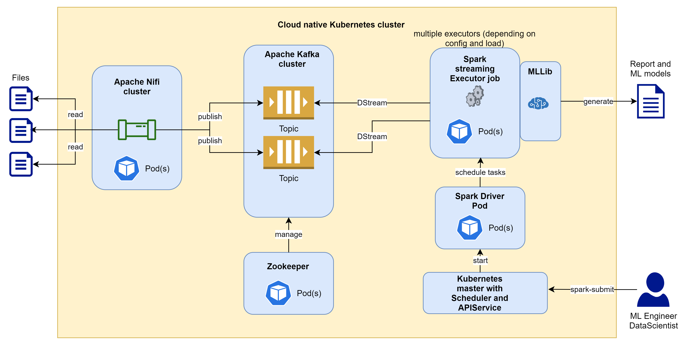

## Overview - Data Intensive Real-Time Streaming Application Architecture

### Architecture

### Setup

#### Preparation for local setup

On local environments the setup needs following steps:
1. Installation of local Docker and Kubernetes support
2. .......
n. For further usage use local command shell 

#### Preparation for cloud setup on Microsoft Azure
1. Get Azure Account
2. ....
n. For further usage use Azure Cloud Shell

#### Setup Apache Nifi with Helm charts
todo

#### Setup Apache Kafka and Zookeeper with Helm charts
todo

#### Setup mobile generator sample app
The mobile generator app will generate random sample data with random GPS locations.

Steps
1. Create docker image: `docker build -t mobile_generator .`
2. Run Docker image with parameters: `docker run -v c:/temp:/var/tmp --rm mobile_generator /var/tmp 20`

### Usage and configuration

#### Deploy Apache Nifi Task
todo

#### Build Spark container job
todo

#### Deploy Apache Spark job
The following Apache Spark job will determine the current geographic location of all mobile phones sending data.
It uses Spark real time streaming KMeans clustering ML technique to do in real time the ML learning and prediction
to identify the geographic locations. This will allow, in real time to analyze large mobile data loads and see in which
regions the users are clustered.

