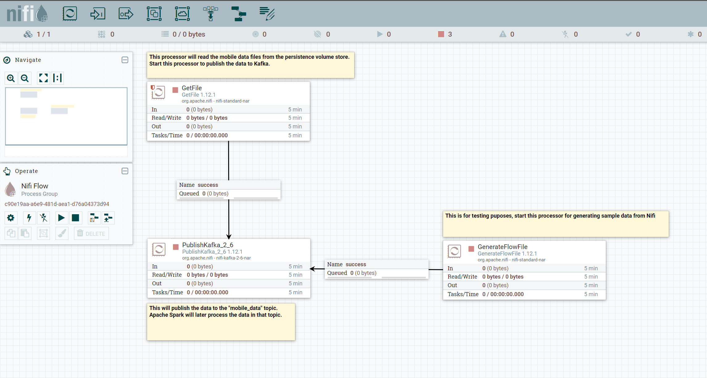

## Overview - Data Intensive Real-Time Streaming Application Architecture

### Architecture of the multi cluster setup for large data volume scaling

The application architecture is able to do realtime Machine Learning analytics on large scale data ingestion.

The following documentation is divided into an installation and setup path. The installation has to be done once and the setup path
could be used multiple times to change the configuration.

### Installation

#### Preparation for local setup

On local environments the setup needs following steps:
1. Installation of local Docker and Kubernetes support
2. Install Helm on your local or cloud shell
3. For further usage use local command shell
4. Local Java >11 and SBT to build Apache Spark job

#### Preparation for cloud setup on Microsoft Azure
1. Get Azure Account
2. Start a Kubernetes cluster with minimal 1 node
3. For further usage use Azure Cloud Shell

#### 1. Create shared persistent volume stores
`kubectl apply -f sharedvolume.yaml` && `kubectl apply -f volume_claim.yaml`

#### 2. Setup Apache Nifi cluster with shared persistence store
`helm repo add cetic https://cetic.github.io/helm-charts`

`helm repo update`

`helm install -f values.yaml my-nifi-cluster cetic/nifi`

Depending on the performance of the cluster (local or cloud), the first start needs some time to initialize Apache Nifi.

To uninstall the cluster `helm uninstall my-nifi-cluster`

#### 3. Setup Apache Kafka and Zookeeper cluster with shared persistence store
`helm repo add bitnami https://charts.bitnami.com/bitnami`

`helm repo update`

`helm install -f values.yaml my-kafka-cluster bitnami/kafka`

To uninstall the cluster `helm uninstall my-kafka-cluster`

For debugging purposes to manage/debug the data on Kafka in Kubernetes

`kubectl run my-kafka-cluster-client --restart='Never' --image docker.io/bitnami/kafka:2.8.0-debian-10-r61 --namespace default --command -- sleep infinity`

`kubectl exec --tty -i my-kafka-cluster-client --namespace default -- bash`

`kafka-console-producer.sh --broker-list my-kafka-cluster-0.my-kafka-cluster-headless.default.svc.cluster.local:9092 --topic mobile_data`

`kafka-console-consumer.sh --bootstrap-server my-kafka-cluster.default.svc.cluster.local:9092 --topic mobile_data --from-beginning`
#### 4. Setup mobile generator sample app
The mobile generator app will generate random sample data with random GPS locations.
1. Create docker image: `docker build -t juergen1976/mobile_generator .`
2. Publish on DockerHub: `docker push juergen1976/mobile_generator`

#### 5. Build Spark container job
1. Install local Apache Spark and set the SPARK_HOME environment variable
2. `$SPARK_HOME/bin/docker-image-tool.sh -r juergen1976 -t 1.0 build`

#### 6. Create Kubernetes service account for Spark
`kubectl create serviceaccount spark`

### Usage and configuration

#### 0. Prerequisites
1. Local or cloud ready Kubernetes cluster
2. Helm chart support in the local or cloud shell

#### 1. Deploy mobile generator sample app
On local docker environment
`docker run -v c:/temp:/var/tmp --rm juergen1976/mobile_generator /var/tmp 20`

On Kubernetes environment
`kubectl apply -f mobile_generator.yaml`

#### 2. Deploy Apache Nifi work template
1. Access nifi on your cluster. Locally: http://localhost:8080/nifi
2. In the operation panel window, import the file ReadFilesAndPublishToKafka.xml
3. Drag and drop the imported template from the template menu to the canvas
4. Use the Nifi workflow as described in the screenshot

#### 3. Optional (when code changes) - Build spark application
In SparkStreamApp project:
`sbt package` This will build SparkStreamingAnalyseMobileData.jar

#### 4. Deploy Apache Spark job
Example on Windows, adapt to local OS system
`bin/spark-submit --master k8s://https://kubernetes.docker.internal:6443 \
 --deploy-mode cluster --name spark-pi \
 --jars https://repo1.maven.org/maven2/org/apache/spark/spark-sql-kafka-0-10_2.12/3.1.2/spark-sql-kafka-0-10_2.12-3.1.2.jar,https://repo1.maven.org/maven2/org/apache/kafka/kafka-clients/2.8.0/kafka-clients-2.8.0.jar,https://repo1.maven.org/maven2/org/apache/spark/spark-token-provider-kafka-0-10_2.12/3.1.2/spark-token-provider-kafka-0-10_2.12-3.1.2.jar,https://repo1.maven.org/maven2/org/apache/commons/commons-pool2/2.11.0/commons-pool2-2.11.0.jar \
 --class SparkStreamingConsumeKafka \
 --conf spark.kubernetes.authenticate.driver.serviceAccountName=spark \
 --conf spark.executor.instances=5 \
 --conf spark.kubernetes.container.image=juergen1976/spark:1.0 https://github.com/juergen1976/dataintensive_mobile_streaming/raw/master/SparkSubmit/SparkStreamingAnalyseMobileData.jar`

more information how to deploy spark jobs: https://spark.apache.org/docs/2.4.5/running-on-kubernetes.html

The mentioned Apache Spark job will determine the current geographic location of all mobile phones sending data.
It uses Spark real time streaming KMeans clustering ML technique to do in real time the ML learning and prediction
to identify the geographic locations. This will allow, in real time to analyze large mobile data loads and see in which
regions the users are clustered.

