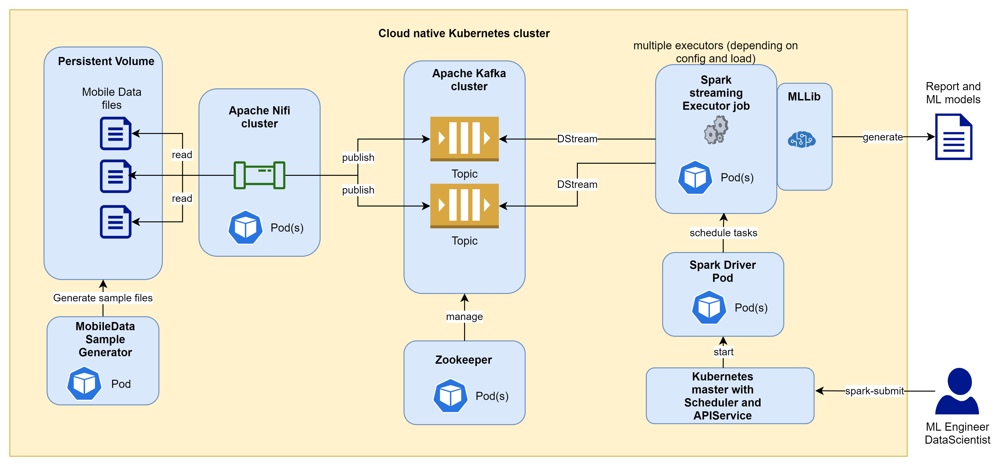

## Overview - Data Intensive Real-Time Streaming Application Architecture

### Architecture

### Setup

#### Preparation for local setup

On local environments the setup needs following steps:
1. Installation of local Docker and Kubernetes support
2. .......
n. For further usage use local command shell 

#### Preparation for cloud setup on Microsoft Azure
1. Get Azure Account
2. ....
n. For further usage use Azure Cloud Shell

#### Setup Apache Nifi with Helm charts
todo

#### Setup Apache Kafka and Zookeeper with Helm charts
todo

#### Setup mobile generator sample app
todo

### Usage and configuration

#### Deploy Apache Nifi Task
todo

#### Build Spark container job
todo

#### Deploy Apache Spark job
todo

